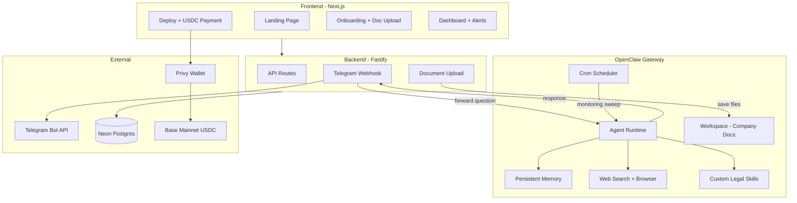

# Enhance ClawCounsel for Hackathon

## Architecture Change: OpenClaw as Agent Runtime

The biggest change is replacing raw `anthropic.messages.create()` calls with OpenClaw as the agent backend. This gives us persistent memory, internet access, browser automation, cron scheduling, and a skills system -- for free.



**What OpenClaw replaces:**

- `agent.ts` `askAgent()` -- replaced by `openclaw agent --message "..."` (persistent memory, tool use, web access)
- `agent.ts` `runMonitoringSweep()` -- replaced by OpenClaw cron job with a legal monitoring skill
- `ingestion.ts` `retrieveContext()` -- OpenClaw reads documents directly from workspace + has built-in memory search
- Keyword-based search -- OpenClaw's agent can read/search files intelligently

**What we keep:**

- Fastify backend for API routes, Telegram webhook handling, DB operations
- Next.js frontend with the terminal UI (unchanged aesthetic)
- Postgres for agent metadata, onboarding data, alerts, subscription records
- Telegram webhook flow (our backend receives messages, forwards to OpenClaw, sends response back)

---

## Phase 1: OpenClaw Setup + Integration

**Install and configure OpenClaw:**

```bash
npm install -g openclaw@latest
openclaw onboard --install-daemon
```

**Workspace setup at `~/.openclaw/workspace/`:**

Create `AGENTS.md` -- this is the core personality/instructions file:

```markdown
# OpenClaw Legal Counsel Agent

You are a legal counsel AI assistant for a company. Your role:

- Answer legal questions grounded in the company's uploaded documents
- Monitor for legal risks: overdue payments, contract breaches, IP issues
- Search the web when needed to verify legal information
- Check GitHub for potential copyright infringement when asked
- Be precise, cite specific documents and clauses

Company context is loaded from onboarding data and workspace documents.
When answering, always reference which document or source you're drawing from.
```

Create custom skills in `~/.openclaw/workspace/skills/`:

- `legal-analysis/SKILL.md` -- how to analyze contracts and legal documents
- `contract-monitor/SKILL.md` -- what patterns to look for (payment terms, deadlines, breach clauses)
- `copyright-watch/SKILL.md` -- how to use web_search + browser to check for IP infringement

**OpenClaw config (`~/.openclaw/openclaw.json`):**

```json5
{
  agent: {
    model: "anthropic/claude-sonnet-4-6",
  },
  tools: {
    allow: ["group:fs", "group:web", "browser", "cron", "group:memory"],
  },
}
```

**Backend integration in [backend/src/services/agent.ts](backend/src/services/agent.ts):**

Replace `askAgent()`:

- Instead of calling `anthropic.messages.create()`, shell out to OpenClaw CLI:
  ```typescript
  const proc = Bun.spawn([
    "openclaw",
    "agent",
    "--message",
    question,
    "--thinking",
    "low",
  ]);
  const response = await new Response(proc.stdout).text();
  ```
- OpenClaw handles: memory, context retrieval, document access, web search
- We still persist the Q&A to our `conversations` table for dashboard display

Replace `runMonitoringSweep()`:

- Set up an OpenClaw cron job that runs the `contract-monitor` skill periodically
- Or keep our manual trigger endpoint but forward to OpenClaw: `openclaw agent --message "Run a monitoring sweep..."`
- Parse the response for alerts and store in our `alerts` table

---

## Phase 2: USDC Payment on Deploy

Add real on-chain USDC payment to [frontend/app/deploy/page.tsx](frontend/app/deploy/page.tsx).

**Chain: Base Mainnet** / **Wallet: Privy**

**New dependencies (frontend):**

- `@privy-io/react-auth` -- wallet connection + embedded wallets
- `viem` -- EVM interactions

**Setup:**

- Create Privy app at dashboard.privy.io, get App ID
- Configure Base Mainnet in Privy dashboard
- Wrap app in `<PrivyProvider>` in layout or providers file
- Env vars: `NEXT_PUBLIC_PRIVY_APP_ID`, `NEXT_PUBLIC_TREASURY_ADDRESS`
- USDC on Base: `0x833589fCD6eDb6E08f4c7C32D4f71b54bdA02913`

**Deploy page rework (3 steps):**

1. Company info (existing: name, ID)
2. **Payment step (NEW):** Privy `login()` -> show "50 USDC" -> "Pay" button -> ERC-20 `transfer()` on Base -> confirm tx -> store tx hash + wallet address
3. Deploy animation (existing) -> redirect to onboarding

**Backend:** Accept `paymentTxHash` + `walletAddress` in `POST /api/agents`, store on agent row.

**Schema:** Add `paymentTxHash` text field to `agents` table.

---

## Phase 3: Redesign Onboarding Questions

Replace the legal-claim-focused questions in [frontend/app/onboarding/page.tsx](frontend/app/onboarding/page.tsx).

**New question set:**

1. "What industry is your company in?"
2. "What types of legal documents does your company handle?" (contracts, NDAs, vendor agreements, employment, IP licenses)
3. "What are your primary legal concerns?" (contract compliance, IP protection, vendor management, payment tracking)
4. "How many active contracts or vendor relationships do you manage?"
5. "What should your agent prioritize monitoring?" (payment deadlines, contract renewals, compliance dates, IP infringement)

**Schema change:** Replace old `onboarding_data` columns with `industry`, `documentTypes`, `legalConcerns`, `activeContracts`, `monitoringPriorities`.

**Backend:** Update onboarding POST handler for new fields. Also write the onboarding answers to a `COMPANY_CONTEXT.md` file in the OpenClaw workspace so the agent can reference it.

---

## Phase 4: Document Upload + Workspace Storage

During onboarding, let users upload PDFs and documents. Instead of chunking into a DB (our old approach), we save files directly to the OpenClaw workspace where the agent can read them with its built-in `read` tool.

**Frontend: Add upload step to onboarding (Step 2 of 3)**

In [frontend/app/onboarding/page.tsx](frontend/app/onboarding/page.tsx):

- Drag-and-drop zone for PDFs and text files
- Upload via multipart form to `POST /api/agents/:agentId/documents`
- Terminal-style processing animation:
  ```
  > Uploading vendor_agreement.pdf... done
  > Uploading company_nda.pdf... done
  > 2 documents added to agent workspace
  > Agent ready to analyze.
  ```

**Backend changes in [backend/src/routes/documents.ts](backend/src/routes/documents.ts):**

- Accept multipart file upload
- For PDFs: extract text with `pdf-parse`, save as `.txt` to OpenClaw workspace (`~/.openclaw/workspace/documents/`)
- For text files: save directly to workspace
- Also store metadata in our `documents` DB table for dashboard display
- Return `{ documentId, filename, status: 'ready' }`

New dependency: `pdf-parse`

The key insight: OpenClaw's agent can `read` these files directly from the workspace. No need for our custom chunking/embedding pipeline -- the agent is smart enough to read and search files on its own.

---

## Phase 5: Monitoring + Alerts

**OpenClaw cron for automated monitoring:**

Configure a cron job in OpenClaw that periodically asks the agent to scan documents for legal risks. The agent uses its `read` tool to check documents, `web_search` to verify deadlines, and reports risks.

**Backend:**

1. `POST /api/agents/:agentId/monitor` -- manual trigger (calls OpenClaw CLI with monitoring prompt)
2. `GET /api/agents/:agentId/alerts` -- fetch alerts from DB
3. After monitoring, parse OpenClaw's response for structured alerts, store in `alerts` table
4. Send alert summary to Telegram group via bot API

**Frontend in [frontend/app/dashboard/[agentId]/page.tsx](frontend/app/dashboard/[agentId]/page.tsx):**

- Fetch and display real alerts with severity badges
- Show alert count on dashboard list page

---

## Onboarding Flow (3 steps)

```
Step 1: Company Context (5 questions)
   |
Step 2: Upload Documents (PDFs, text files -> OpenClaw workspace)
   |
Step 3: Connect Telegram (existing flow, works as-is)
```

---

## Files Changed Summary

**Frontend:**

- `frontend/app/layout.tsx` -- PrivyProvider wrapper
- `frontend/app/deploy/page.tsx` -- add payment step with Privy
- `frontend/app/onboarding/page.tsx` -- new questions + document upload step
- `frontend/app/dashboard/[agentId]/page.tsx` -- show real alerts
- `frontend/app/dashboard/page.tsx` -- show alert counts
- `frontend/package.json` -- add `@privy-io/react-auth`, `viem`

**Backend:**

- `backend/src/services/agent.ts` -- replace Claude SDK with OpenClaw CLI calls
- `backend/src/routes/agents.ts` -- new alert/monitor endpoints, updated onboarding, payment field
- `backend/src/routes/documents.ts` -- real file upload, save to OpenClaw workspace
- `backend/src/db/schema.ts` -- new onboarding fields + payment tx field
- `backend/index.ts` -- monitoring scheduler
- `backend/package.json` -- add `pdf-parse`

**OpenClaw (new files):**

- `~/.openclaw/openclaw.json` -- gateway config
- `~/.openclaw/workspace/AGENTS.md` -- legal counsel personality + instructions
- `~/.openclaw/workspace/skills/legal-analysis/SKILL.md` -- document analysis skill
- `~/.openclaw/workspace/skills/contract-monitor/SKILL.md` -- monitoring patterns skill
- `~/.openclaw/workspace/skills/copyright-watch/SKILL.md` -- IP infringement detection skill
- `~/.openclaw/workspace/documents/` -- uploaded company documents live here
- `~/.openclaw/workspace/COMPANY_CONTEXT.md` -- onboarding answers for agent reference
